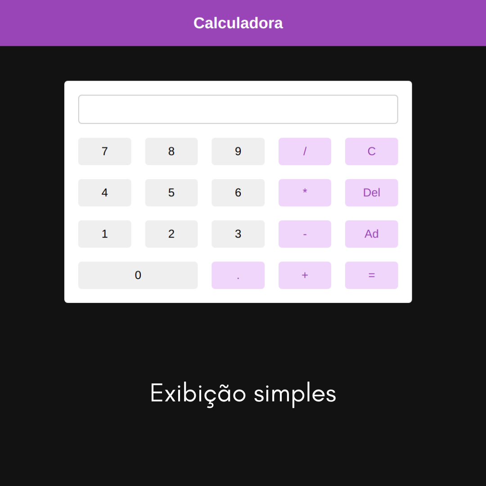
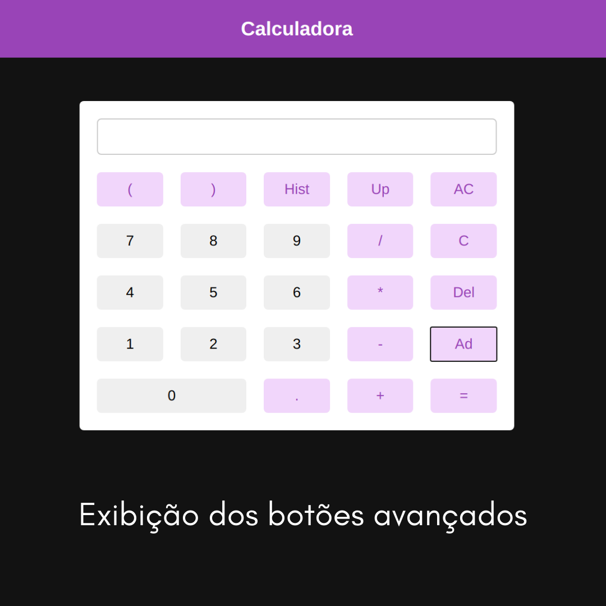
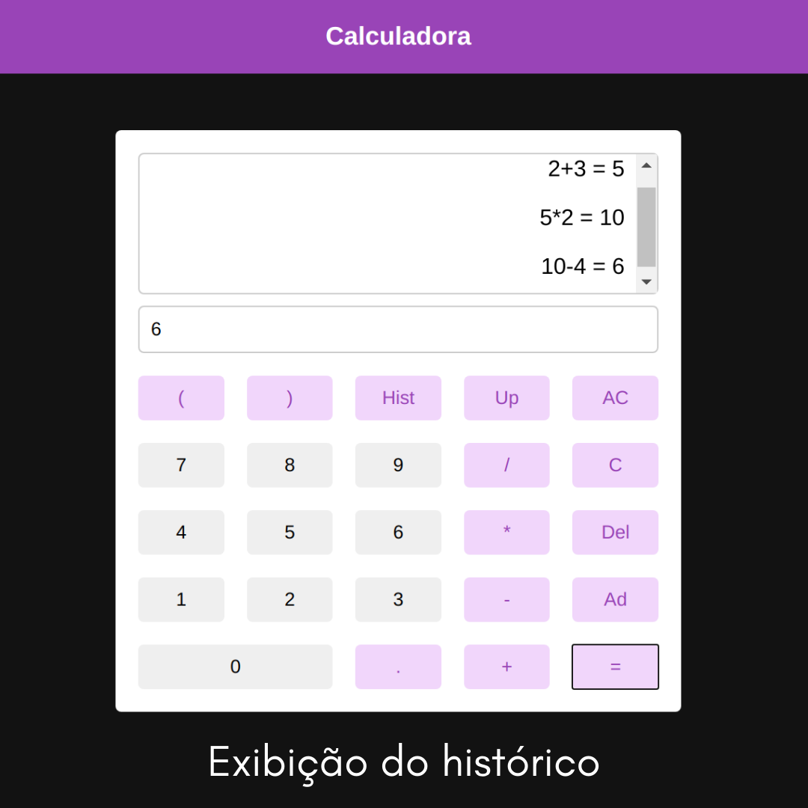

## Calculadora

#### Primeiro projeto do curso [React Profissional](https://www.udemy.com/course/react-redux-profissional/) do professor [Bruno Nardini](https://www.linkedin.com/in/brunonardini/).
 

A calculadora é exibida, em um primeiro momento, em sua forma simples. Ao clicarmos no botão "Ad" (advanced), temos a exibição dos botões avançados. Podemos também clicar em "Hist" (history) para a exibição do histórico de operações e resultados.

-> Interaja com a calculadora [aqui](https://codepen.io/furtadomn/pen/ExXrpJG) ! :wink:

 

